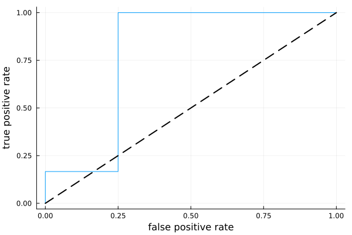

# Precision-Recall Curves

In binary classification problems, precision-recall curves (or PR curves) are a popular
alternative to [Receiver Operator Characteristics](@ref) when the target values are highly
imbalanced.

## Example

```@example 70
using StatisticalMeasures
using CategoricalArrays
using CategoricalDistributions

# ground truth:
y = categorical(["X", "O", "X", "X", "O", "X", "X", "O", "O", "X"], ordered=true)

# probabilistic predictions:
X_probs = [0.3, 0.2, 0.4, 0.9, 0.1, 0.4, 0.5, 0.2, 0.8, 0.7]
ŷ = UnivariateFinite(["O", "X"], X_probs, augment=true, pool=y)
ŷ[1]
```

```julia
using Plots
precisions, recalls, thresholds = precision_recall_curve(ŷ, y)
plt = plot(recalls, precisions, legend=false)
plot!(plt, xlab="recall", ylab="precision")

# proportion of observations that are positive:
p = precisions[end] # threshold=0
plot!([0, 1], [p, p], linewidth=2, linestyle=:dash, color=:black)
```



## Reference

```@docs
precision_recall_curve
```
